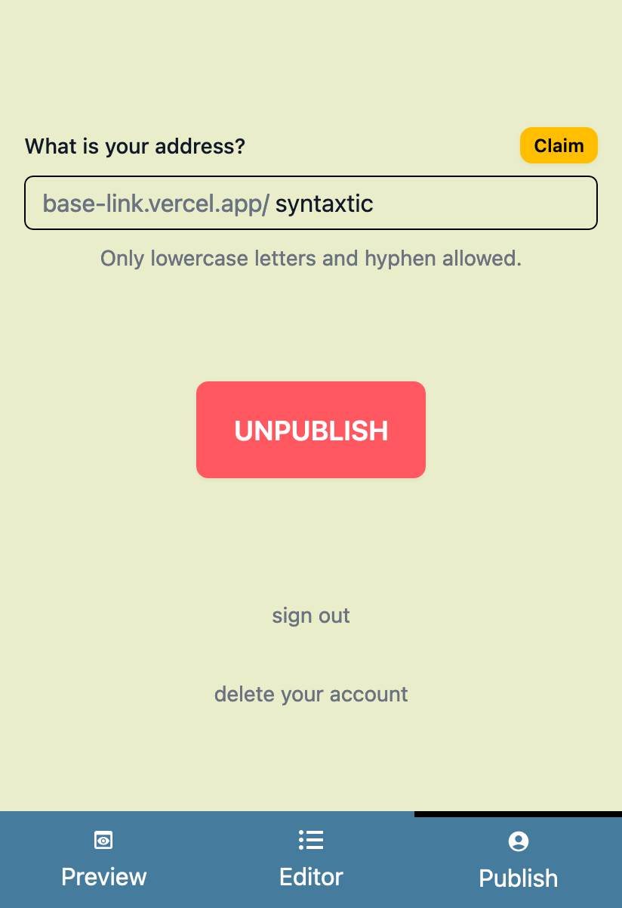

# Base Link

Sample Next.js@14 project where users can create and publish profiles with their links.

Deployment: [base-link.vercel.app](https://base-link.vercel.app/)

## Tech Stack

- [Next.js@14](https://nextjs.org/)
- [TypeScript](https://www.typescriptlang.org/)
- [NextAuth.js](https://next-auth.js.org/)
- [Prisma ORM](https://www.prisma.io/) with MySQL
- [Tailwind CSS](https://tailwindcss.com/) & [daisyUI](https://daisyui.com/)
- [ESLint](https://eslint.org/), [Prettier](https://prettier.io/), [React Icons](https://www.npmjs.com/package/react-icons), ...

## Improvement & Practice Ideas

- App router & server-side rendering (SSR)
- Dynamic routes with incremental static regeneration (ISR)
- Explore configs: next.config.js, tsconfig.json, .eslintrc.json, ...
- Add more authentication providers
- Add more sections and more styling options
- Add more account management options
- Add image uploading for sections and backgrounds
- Add the ability to create multiple profiles with one account
- Improve request traffic and validations
- Improve SEO and the metadata of the profile pages
- Add analytics

## How to

0. Setup an empty MySQL database and generate Google Auth credentials
1. Screenshot all the code files, extract the texts from images with AI, paste them in your own files with correct extensions
2. Download the dependencies: `npm ci`
3. Generate database client: `npx prisma generate`
4. Rename `.env.example` as `.env` and add your environment variables: DB URL, Google Credentials and [NEXTAUTH_SECRET](https://next-auth.js.org/configuration/options#nextauth_secret)
5. [Migrate](https://www.prisma.io/docs/orm/prisma-migrate/getting-started) DB schema: `npx prisma migrate dev --name fresh`
6. ([Included](https://www.prisma.io/docs/orm/prisma-migrate/workflows/seeding#integrated-seeding-with-prisma-migrate) with the prev step) Seed sample data: `npx prisma db seed` (see `./prisma/seed.ts`)
7. Start development: `npm run dev`

## Screenshots v0.0.1

   
 
